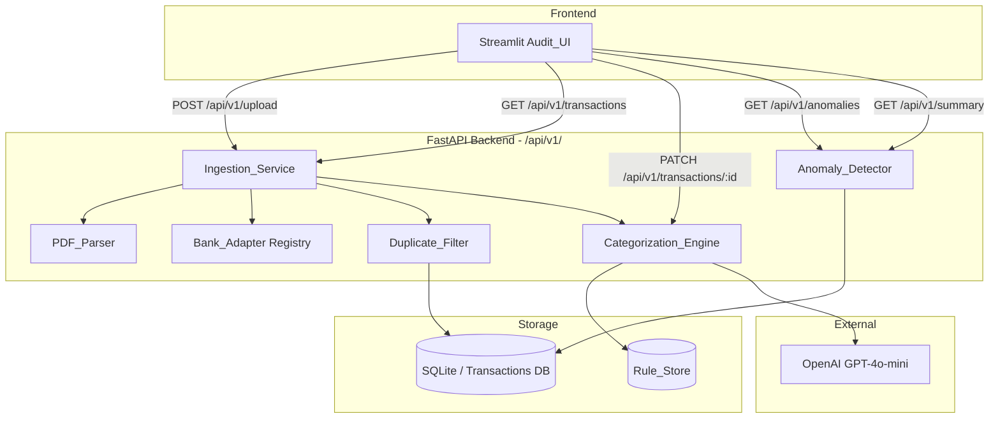

# Design Document: Personal Finance Audit Tool

## Overview

The Personal Finance Audit Tool is a Python application that ingests CSV and PDF bank statements from multiple Indian banks, normalizes them into a unified transaction schema, auto-categorizes transactions using a rule-based engine with LLM fallback, and surfaces spending trends and anomalies through a Streamlit UI backed by a versioned FastAPI REST API.

The system is designed so the Streamlit frontend is fully replaceable by any HTTP client (e.g., React) without backend changes. All business logic lives in the FastAPI backend; the frontend is a thin consumer of the `/api/v1/` contract.

---

## Architecture



**Key design decisions:**

- FastAPI handles all business logic and data persistence; Streamlit calls it over HTTP (not direct function calls), ensuring true frontend/backend separation.
- SQLite is used for local-first simplicity; the ORM layer (SQLAlchemy) makes it swappable.
- The Rule_Store is a table in the same SQLite database, not a separate file, to keep transactions atomic.
- PDF parsing uses `pdfplumber` for text extraction (handles multi-column layouts common in Indian bank statements).
- LLM calls are wrapped in a circuit-breaker pattern: if the call fails, the category defaults to `Other`.

---

## Components and Interfaces

### Ingestion_Service

Handles file upload, routing to PDF_Parser or direct CSV parsing, Bank_Adapter selection, deduplication, and categorization.

```
POST /api/v1/upload
  Request: multipart/form-data, one or more files
  Response: {
    "transactions": [Transaction],
    "summary": { "new": int, "duplicates": int }
  }
```

Internally:
1. For each file: detect MIME type.
2. If PDF → PDF_Parser → extracted text → Bank_Adapter (text mode).
3. If CSV → read header row → Bank_Adapter (CSV mode).
4. Bank_Adapter produces raw `(date, description, amount)` rows.
5. Derive deterministic `id` = `sha256(date + "|" + description + "|" + str(amount))[:16]`.
6. Duplicate_Filter checks DB; discard if exists.
7. Categorization_Engine assigns category.
8. Persist and return.

### PDF_Parser

Wraps `pdfplumber`. Accepts a file-like object, returns extracted text per page joined as a single string.

```python
class PDF_Parser:
    def extract_text(self, file: BinaryIO) -> str: ...
    # Raises: PasswordProtectedError, NoExtractableTextError, ParseError
```

### Bank_Adapter

Abstract base + concrete implementations. Each adapter declares the header signature it recognizes and implements the row-mapping logic.

```python
class BankAdapter(ABC):
    @property
    def header_signature(self) -> frozenset[str]: ...  # column names for CSV detection
    @property
    def text_patterns(self) -> list[str]: ...          # regex patterns for PDF detection

    def parse_csv_rows(self, reader: csv.DictReader) -> list[RawTransaction]: ...
    def parse_pdf_text(self, text: str) -> list[RawTransaction]: ...

class HDFCSavingsAdapter(BankAdapter): ...
class ICICISavingsAdapter(BankAdapter): ...
class GenericCreditCardAdapter(BankAdapter): ...
```

The `AdapterRegistry` iterates registered adapters and returns the first match.

### Duplicate_Filter

```python
class DuplicateFilter:
    def filter(self, transactions: list[RawTransaction]) -> tuple[list[RawTransaction], int]:
        # Returns (new_transactions, duplicate_count)
```

### Categorization_Engine

```python
class CategorizationEngine:
    def categorize(self, description: str) -> str:
        # 1. Query Rule_Store ordered by priority DESC
        # 2. If match: return rule.category
        # 3. Else: call LLM
        # 4. If LLM fails: return "Other"
```

LLM prompt is a zero-shot classification prompt constrained to the 8 valid categories.

### Anomaly_Detector

```python
class AnomalyDetector:
    def compute_anomalies(self, reference_date: date) -> list[AnomalyResult]:
        # 1. Compute rolling_avg per category over 3 months before reference_date
        # 2. Compute current_month total per category
        # 3. Flag if current > rolling_avg * 1.3 AND rolling_avg has >= 3 months of data
```

```
GET /api/v1/anomalies?month=YYYY-MM
  Response: [{ "category": str, "current": float, "rolling_avg": float, "deviation_pct": float }]

GET /api/v1/summary?start=YYYY-MM-DD&end=YYYY-MM-DD
  Response: {
    "buckets": { "Needs": float, "Wants": float, "Investments": float },
    "unreviewed_count": int
  }
```

### Rule_Store

SQLite table `rules(id, pattern, category, priority, created_at)`. Pattern is a case-insensitive substring match by default; can be upgraded to regex.

```
GET  /api/v1/rules          → list all rules
POST /api/v1/rules          → create rule manually
DELETE /api/v1/rules/:id    → remove rule
```

---

## Data Models

### Transaction (canonical schema)

```python
class Transaction(BaseModel):
    id: str                  # sha256-derived hex string, 16 chars
    date: date               # YYYY-MM-DD
    description: str
    amount: float            # positive = debit, negative = credit
    category: str            # one of the 8 defined categories
    is_reviewed: bool
```

### RawTransaction (internal, pre-persistence)

```python
@dataclass
class RawTransaction:
    date: date
    description: str
    amount: float
```

### Rule

```python
class Rule(BaseModel):
    id: int
    pattern: str
    category: str
    priority: int
    created_at: datetime
```

### AnomalyResult

```python
class AnomalyResult(BaseModel):
    category: str
    current_month_spend: float
    rolling_avg: float
    deviation_pct: float     # (current - avg) / avg * 100
```

### Category → Bucket Mapping

| Category      | Bucket      |
|---------------|-------------|
| Utilities     | Needs       |
| Healthcare    | Needs       |
| Transport     | Needs       |
| Food          | Wants       |
| Entertainment | Wants       |
| Shopping      | Wants       |
| Investment    | Investments |
| Other         | (unclassified, excluded from breakdown) |

### Database Schema (SQLite via SQLAlchemy)

```sql
CREATE TABLE transactions (
    id          TEXT PRIMARY KEY,
    date        TEXT NOT NULL,
    description TEXT NOT NULL,
    amount      REAL NOT NULL,
    category    TEXT NOT NULL,
    is_reviewed INTEGER NOT NULL DEFAULT 0
);

CREATE TABLE rules (
    id          INTEGER PRIMARY KEY AUTOINCREMENT,
    pattern     TEXT NOT NULL UNIQUE,
    category    TEXT NOT NULL,
    priority    INTEGER NOT NULL DEFAULT 0,
    created_at  TEXT NOT NULL
);
```

---

## Correctness Properties

*A property is a characteristic or behavior that should hold true across all valid executions of a system — essentially, a formal statement about what the system should do. Properties serve as the bridge between human-readable specifications and machine-verifiable correctness guarantees.*

### Property 1: Bank adapter selection is exhaustive and exclusive

*For any* CSV header row, the adapter registry SHALL return exactly one matching adapter if the header matches a known bank signature, and raise an error if it matches none. No header should match more than one adapter.

**Validates: Requirements 1.1, 1.3**

---

### Property 2: Bank adapter field mapping preserves all data

*For any* raw bank row (CSV or PDF text), the selected Bank_Adapter SHALL produce a RawTransaction where `date`, `description`, and `amount` are all non-null and the amount is a finite number.

**Validates: Requirements 1.2, 1.9**

---

### Property 3: Multi-file merge is the union of individual results

*For any* collection of N valid files, processing them together SHALL produce a transaction list whose size equals the sum of the sizes of processing each file individually (before deduplication).

**Validates: Requirements 1.5**

---

### Property 4: PDF text extraction covers all pages

*For any* valid multi-page PDF, the extracted text SHALL contain content from every page (i.e., no page is silently dropped).

**Validates: Requirements 1.7**

---

### Property 5: Transaction ID derivation is deterministic

*For any* `(date, description, amount)` triple, calling the ID derivation function twice SHALL produce the same ID. Two triples that differ in any field SHALL produce different IDs (collision resistance within the domain).

**Validates: Requirements 2.1**

---

### Property 6: Deduplication is idempotent

*For any* set of transactions, inserting the same set twice SHALL result in the same database state as inserting it once. The `new` count on the second insert SHALL be 0 and the `duplicates` count SHALL equal the total input count.

**Validates: Requirements 2.2, 2.3**

---

### Property 7: Batch summary counts are consistent

*For any* batch upload, `summary.new + summary.duplicates` SHALL equal the total number of transactions parsed from the input files.

**Validates: Requirements 2.3**

---

### Property 8: Highest-priority matching rule wins categorization

*For any* description and any Rule_Store containing at least one matching rule, the Categorization_Engine SHALL assign the category of the rule with the highest priority value, and the resulting transaction SHALL have `is_reviewed = false`.

**Validates: Requirements 3.1, 3.2**

---

### Property 9: LLM fallback is invoked iff no rule matches, and result is applied

*For any* description that matches no rule in the Rule_Store, the Categorization_Engine SHALL invoke the LLM exactly once and assign the returned category with `is_reviewed = false`. If the LLM is unavailable, the category SHALL be `Other` with `is_reviewed = false`.

**Validates: Requirements 3.4, 3.5, 3.6**

---

### Property 10: Correction updates category and marks reviewed

*For any* transaction and any valid category string, applying a correction SHALL set the transaction's `category` to the new value and `is_reviewed` to `true`.

**Validates: Requirements 4.3**

---

### Property 11: Correction persists a rule for future use

*For any* correction applied to a transaction with description D and new category C, the Rule_Store SHALL subsequently contain a rule that maps D to C, such that a new transaction with the same description is categorized as C without LLM invocation.

**Validates: Requirements 4.4**

---

### Property 12: Anomaly flagging threshold is exact

*For any* category where `current_month_spend > rolling_avg * 1.30` AND at least 3 months of history exist, the Anomaly_Detector SHALL flag that category. *For any* category where `current_month_spend <= rolling_avg * 1.30` OR fewer than 3 months of history exist, the Anomaly_Detector SHALL NOT flag that category.

**Validates: Requirements 5.1, 5.2, 5.4**

---

### Property 13: Deviation percentage is computed correctly

*For any* flagged anomaly, `deviation_pct` SHALL equal `(current_month_spend - rolling_avg) / rolling_avg * 100`, rounded to two decimal places.

**Validates: Requirements 5.3**

---

### Property 14: Category-to-bucket mapping is total and correct

*For any* transaction with a category in {Utilities, Healthcare, Transport, Food, Entertainment, Shopping, Investment}, the bucket assignment SHALL match the defined mapping table exactly.

**Validates: Requirements 6.1**

---

### Property 15: Bucket totals are the sum of constituent transactions

*For any* set of fully-reviewed transactions filtered to a date range, the total for each bucket SHALL equal the sum of `amount` for all transactions in that bucket within the range.

**Validates: Requirements 6.2, 6.4**

---

### Property 16: Transaction serialization round-trip

*For any* Transaction object, serializing it to JSON and deserializing it back SHALL produce an object equal to the original, with all fields conforming to the schema types.

**Validates: Requirements 7.2**

---

### Property 17: Malformed payloads always yield HTTP 422

*For any* API request body that is missing required fields or contains fields of the wrong type, the API SHALL return HTTP 422 with a structured validation error body.

**Validates: Requirements 7.3**

---

## Error Handling

| Scenario | Component | Response |
|---|---|---|
| Unrecognized CSV header | AdapterRegistry | HTTP 422, body: `{ "error": "unrecognized_header", "columns": [...] }` |
| Password-protected PDF | PDF_Parser | HTTP 422, body: `{ "error": "pdf_password_protected" }` |
| Image-only PDF (no text) | PDF_Parser | HTTP 422, body: `{ "error": "pdf_requires_ocr" }` |
| Unrecognized PDF bank pattern | Ingestion_Service | HTTP 422, body: `{ "error": "unrecognized_bank_format" }` |
| LLM service unavailable | Categorization_Engine | Silently assign `Other`; log warning |
| LLM returns invalid category | Categorization_Engine | Assign `Other`; log warning |
| Malformed request payload | FastAPI/Pydantic | HTTP 422 (automatic via Pydantic validation) |
| Transaction not found (PATCH) | FastAPI route | HTTP 404, body: `{ "error": "transaction_not_found", "id": "..." }` |
| Database error | SQLAlchemy layer | HTTP 500, body: `{ "error": "internal_error" }`; full traceback logged server-side only |

All error responses follow the shape `{ "error": "<error_code>", ...optional_fields }` to give the frontend a machine-readable code alongside the human-readable message.

---

## Testing Strategy

### Dual Testing Approach

Unit tests cover specific examples, edge cases, and error conditions. Property-based tests verify universal properties across many generated inputs. Both are required for comprehensive coverage.

### Property-Based Testing

The project uses **Hypothesis** (Python) as the property-based testing library. Each property test runs a minimum of 100 iterations (Hypothesis default; `settings(max_examples=100)` applied explicitly).

Each property test is tagged with a comment in the format:
```
# Feature: personal-finance-audit, Property N: <property_text>
```

Properties to implement as Hypothesis tests:

| Property | Test focus | Hypothesis strategy |
|---|---|---|
| P1: Adapter selection exhaustive | `AdapterRegistry.select()` | `st.frozensets(st.text())` for headers |
| P2: Field mapping preserves data | `BankAdapter.parse_csv_rows()` | `st.fixed_dictionaries(...)` per bank schema |
| P3: Multi-file merge is union | `Ingestion_Service.process_files()` | `st.lists(st.binary())` of synthetic CSVs |
| P4: PDF covers all pages | `PDF_Parser.extract_text()` | Programmatically generated PDFs via `fpdf2` |
| P5: ID derivation deterministic | `derive_id()` | `st.tuples(st.dates(), st.text(), st.floats())` |
| P6: Deduplication idempotent | `DuplicateFilter.filter()` + DB | `st.lists(raw_transaction_strategy())` |
| P7: Batch summary consistent | `Ingestion_Service.upload()` | `st.lists(raw_transaction_strategy())` |
| P8: Highest-priority rule wins | `CategorizationEngine.categorize()` | `st.lists(rule_strategy())` + `st.text()` |
| P9: LLM fallback invoked correctly | `CategorizationEngine.categorize()` | `st.text()` with mocked LLM |
| P10: Correction updates fields | `PATCH /api/v1/transactions/:id` | `st.sampled_from(CATEGORIES)` |
| P11: Correction persists rule | `Rule_Store` after correction | `st.text()` descriptions + `st.sampled_from(CATEGORIES)` |
| P12: Anomaly threshold exact | `AnomalyDetector.compute_anomalies()` | `st.floats(min_value=0)` for spend values |
| P13: Deviation pct correct | `AnomalyDetector` output | `st.floats(min_value=0)` |
| P14: Bucket mapping total | `bucket_for_category()` | `st.sampled_from(CATEGORIES)` |
| P15: Bucket totals correct | `compute_summary()` | `st.lists(transaction_strategy())` |
| P16: Serialization round-trip | `Transaction` Pydantic model | `st.builds(Transaction, ...)` |
| P17: Malformed payload → 422 | FastAPI test client | `st.fixed_dictionaries(...)` with missing/wrong-type fields |

### Unit Tests

- One example-based test per Bank_Adapter using a real sample CSV/text fixture.
- Integration test for the full upload → categorize → retrieve flow using an in-memory SQLite DB.
- Smoke tests: verify all 3 adapters are registered, all 8 categories are defined, `/api/v1/docs` returns 200.
- Edge case tests: password-protected PDF, image-only PDF, unknown CSV header, LLM timeout.

### Test Layout

```
tests/
  unit/
    test_pdf_parser.py
    test_bank_adapters.py
    test_categorization_engine.py
    test_anomaly_detector.py
    test_duplicate_filter.py
  property/
    test_properties.py        # all Hypothesis property tests
  integration/
    test_api_upload.py
    test_api_corrections.py
    test_api_anomalies.py
  smoke/
    test_smoke.py
```
